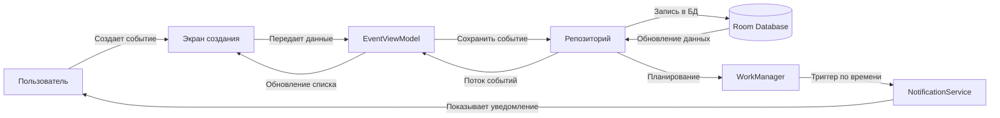

# ScheduleAPP 📅🔔

Android-приложение для создания событий в календаре с интеллектуальными уведомлениями.
Управление напоминаниями и моментальный доступ к предстоящим активностям.

## 🌟 Ключевые возможности
- Создание/редактирование событий с датой и временем

- Гибкие настройки уведомлений 

- Просмотр календаря с визуализацией ивентов

- Оффлайн-доступ к данным и синхронизация

- Реализована темная/светлая темы

## 🛠 Технологии
- **Язык**: Kotlin

- **UI**: Jetpack Compose, Material 3

- **DI**: Hilt

- **Локальная БД**: Room

- **Фоновая обработка**: WorkManager

- **Асинхронность**: Kotlin Coroutines, Flow, StateFlow

- **Архитектура**: MVVM, Clean Architecture

## 🔄 Архитектура жизненного цикла

MIT License © Дмитрий Тимонин.
